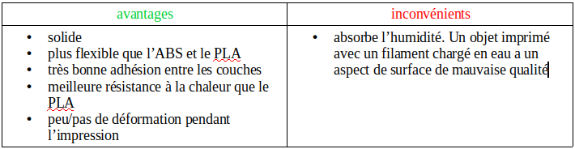

Impression 3D
-----------------------------------------------------------------------------------------------------------

**Tinkercad : *modelisation sur navigataur web*** 

### Télécharger des modèles 3D :
1. [Thingiverse](https://www.thingiverse.com/) est une plateforme de partage de fichiers, majoritairement (voir quasi exclusivement) des modèles fait pour l’impression 3D. On peut télécharger les fichiers, qui sont parfois accompagnés de documents permettant leur usage ou leur assemblage. 
Comme pour tous les projets en ligne, il est indispensable d’en vérifier la licence avant de s’en servir.
2. [Opendesk](https://www.opendesk.cc/) est un des premiers sites à chercher à rendre possible la fabrication distribuée. Il partage des fichiers de mobiliers, créés par des designers, afin que chacun puisse les produire localement, à l’aide d’une fraiseuse numérique. 
En cas d’usage commercial des fichiers, les designers et la plateforme sont rétribués.
3. [Youmagine](https://www.youmagine.com/) et [Cult](https://cults3d.com/) proposent également des catalogues de qualité.

### Trancheurs :
1. Slic3r <http://slic3r.org/>: trancheur libre multi-plateforme. 
Il est facile d’utilisation et tranche rapidement les objets. 
Son interface est très ergonomique et permet aux utilisateurs avancés d’accéder à un grand ensemble de paramètres

2. Kisslicer <http://www.kisslicer.com/> : simple d’utilisation, ce trancheur permet aussi d’accéder à des réglages avancés. La version gratuite ne permet d’utiliser qu’un seul extrudeur et la version payante permet d’en utiliser plusieurs## G-Code

3. Cura <https://ultimaker.com/en/products/ultimaker-cura> : trancheur libre multi-plateforme créé par les fabricants de l’imprimante Ultimaker. Il est simple d’utilisation, mais donne aussi accès à énormément de paramètres pour les utilisateurs avertis.

4. Skeinforge <http://reprap.org/wiki/Skeinforge> : un des plus ancien trancheur libre, écrit en python. Il n’est pas très ergonomique et est très lent comparé aux trancheurs plus récents. Malgré ces défauts, il est considéré comme étant un trancheur produisant un gcode de très bonne qualité.

### MATERIAUX POUR IMPRIMANTES FDM (Fused Deposition Modeling)
Les matières plastiques sont des polymères ou des copolymères. Un polymère est constitué de longues chaînes de molécules identiques appelées monomères. 
Les copolymères sont constitués de plusieurs polymères.

Ces plastiques sont parfois chargés avec des particules d’autres matières pour changer l’aspect des objets obtenus ou les performances mécaniques des pièces imprimées. 
Certains fabricants ajoutent des fibres de bois, de carbone, de la craie, des particules de métal.

1. le PLA (Polylactic Acid) :  
plastique d’origine végétale, il est biodégradable. Il a une température de transition vitreuse de 60°C, ce qui n’est pas très élevé. Une pièce en PLA laissée dans une voiture au soleil risque de se déformer par exemple. Il est par contre très rigide, mais cassant. Les objets imprimés en PLA révèlent généralement bien les détails du modèle 3D original et ont un aspect de surface brillant. Il est facile à imprimer car il ne nécessite pas de lit chauffant et se déforme peu pendant l’impression. 
Il est nécessaire d’utiliser un refroidissement pendant l’impression. C’est le plastique de choix pour s’initier à l’impression 3D.

2. l’ABS (Acrylonitrile Butadiène Styrène) :  
plastique issu de la pétrochimie, il est notamment utilisé pour fabriquer les briques de Lego. Il a une température de transition vitreuse de 105°C ce qui en fait un plastique bien adapté aux applications où les contraintes thermiques sont relativement élevées. Il ne faut pas utiliser un refroidissement pendant l’impression. L’aspect de surface est mat. Il existe un cousin de l’ABS, ASA (Acrylonitrile Styrène Acrylate), 
qui est plus facile à imprimer et qui possède pratiquement les même avantages.

3. le PET/PETG (Polyéthylène téréphtalate glycolisé) :  
plastique issu de la pétrochimie, il est par exemple utilisé pour faire des bouteilles. Il a une température de transition vitreuse de 80°C. Il est un peu moins facile à imprimer que le PLA mais reste beaucoup plus facile que l’ABS car il se déforme très peu. Il est nécessaire d’utiliser un refroidissement pendant l’impression. Il nécessite un lit chauffant à 80°C

4. Les TPE (ThermoPlastic Elastomer) :  
mélange de plastique et de caoutchouc, ce sont des matières élastiques. Il est très difficile d’imprimer ce type de plastique sur une machine utilisant un extrudeur déporté (bowden) même si cela est possible. Les objets réalisés dans ces matériaux sont très résistants au déchirement.

5. PVA (Polylvinyl Alcohol) :  
plastique soluble dans l’eau. Il est typiquement utilisé sur des imprimantes avec au moins deux têtes d’extrusion pour réaliser des supports d’impression. Ce type d’utilisation permet de réaliser des pièces en s’affranchissant de certaines contraintes géométriques tout en pouvant facilement enlever les supports nécessaires.

6. Le polycarbonate :  
plastique extrêmement résistant tant mécaniquement que thermiquement. Il est par exemple utilisé pour fabriquer les vitres de phares automobiles, les casque de moto ou les boucliers de police. Sa température de transition vitreuse est 150°C et il nécessite une température d’impression proche des 300°C pour obtenir une bonne adhésion entre les couches. Il a tendance à se déformer lors de l’impression, 
à la manière de l’ABS mais de manière encore plus prononcée. C’est un matériau difficile à imprimer mais avec des propriétés très intéressantes

### LOGICIEL DE CONTROLE (FIRMWARE)
#### Logiciels pour contrôleurs 8 bit:
1. [Marlin](https://marlinfw.org/) : se compile avec l’environnement de développement arduino. 
La configuration de l’imprimante se fait directement dans le code source du logiciel
2. [Repetier-firmware](https://www.repetier.com/documentation/repetier-firmware/) : tout comme marlin, la compilation se fait avec l’environnement de développement arduino. 
Il est aussi nécessaire de modifier le code source pour configurer l’imprimante
#### Logiciels pour contrôleurs 32 bit:
1. [Smoothieware](http://smoothieware.org/) : pas besoin de compiler le logiciel, même si cela est possible pour les plus intéressés, la configuration se fait par un fichier texte embarqué sur une carte SD, 
ce qui rend la configuration bien plus souple que pour Marlin et Repetier
2. [RepRapFirmware](https://reprap.org/wiki/RepRap_Firmware) : issu du projet RepRap. La configuration se fait exclusivement via des instructions Gcode

G-CODE
-----------------------------------------------------------------------------------------------------------------------------------------------------
### G28
  Cette commande réalise la mise à l’origine des axes X, Y et Z (appelé "homing" en anglais)
    
    G28 X # demande à la machine de ne trouver l'origine que pour l'axe X

    
### G0 et G1
Ce qui différencie les deux instructions est que G0 correspond à un déplacement linéaire rapide et G1 à un déplacement linéaire standard. 
Certains firmwares ne font pas de différence entre déplacement rapide et déplacement standard.

**Ces instructions font se déplacer la tête d’extrusion de manière linéaire. La syntaxe est la suivante:**

        G0 Xnnn Ynnn Znnn Ennn Fnnn Snnn
* Xnnn : déplacement sur l'axe X en mm
* Ynnn : déplacement sur l'axe Y en mm
* Znnn : déplacement sur l'axe Z en mm
* Ennn : déplacement sur l'axe de l'extrudeur en mm
* Fnnn : vitesse de déplacement en mm par minute
* Snnn : vérification ou non du déclenchement d'un capteur de fin de course

Tous les paramètres ne sont pas obligatoires, mais il faut au moins une demande de déplacement sur un des 4 axes.  

Ces commandes ont deux modes de fonctionnement :

1. mode absolu : les coordonnées du point à atteindre sont spécifiées dans la commande. 
Par exemple en mode absolu, la commande "G0 X10 Y20 Z5" demande à la tête d'extrusion de se placer aux coordonnées (10, 20, 5) 
et ce quelle que soit sa précédente position.

2.  mode relatif : la distance à parcourir sur chaque axe est spécifiée dans la commande. 
Par exemple, en mode relatif la commande "G0 X10 Y20 Z5" demande à la tête d'extrusion de se déplacer de 10mm sur l'axe X, 20mm sur l'axe Y et 5mm sur l'axe Z. 
La position finale de la tête dépend donc de sa position avant d'exécuter la commande

**En ce qui concerne l'axe de l'extrudeur, les modes relatifs et absolus se comportent comme suit:**

1. mode absolu : la position souhaitée est précisée dans la commande, ce qui peut entraîner un "rembobinage" du filament. Par exemple si nous considérons l'état de la machine après une impression, l'extrudeur aura poussé une certaine distance de filament dans la buse d'extrusion. Considérons que 100mm de filament ait été utilisé. Si nous demandons à la machine d'exécuter la commande "G0 E110", 10mm supplémentaires de filament vont être poussés par l'extrudeur dans la buse. 
Si par contre il est demandé à la machine d'exécuter "G0 E90", l'extruder va tourner dans le sens inverse pour extraire 10mm de filament

2. mode relatif : dans ce cas, c'est le signe de la valeur qui est passé à la commande qui détermine dans quel sens l'extrudeur va tourner. 
Par exemple, si l'on exécute "G0 E10", 10mm de filament vont être poussés par l'extrudeur dans la buse, quelle que soit la position de l'axe de l'extrudeur.  Si l'on exécute "G0 E-10", 10mm de filament vont être extrait par l'extrudeur de la machine, quelle que soit la position de l'axe de l'extrudeur.

### G90 et G91
Ces deux instructions permettent respectivement de passer en mode de positionnement absolu et relatif pour les axes X, Y et Z. 
Cette commande n'influence pas l'axe de l'extrudeur.

### M82 et M83
Ces deux instructions permettent respectivement de passer en mode de positionnement absolu et relatif pour l'extrudeur.

### M104 et M109
Ces instructions permettent de contrôler la température de la buse d'extrusion. 

    M104 S200 # demande à la buse d'atteindre la température de 200°C et de la maintenir. 
    M109 S200 # demande à la buse d'atteindre la température de 200°C et aucune autre instruction ne sera exécutée par l'imprimante le temps que cette température soit atteinte.
    
### M140 et M190
Ces instructions permettent de contrôler la température de la surface d'impression, le lit. 

    M140 S60 # demande au lit d'atteindre la température de 60°C et de la maintenir. 
    M190 S60 # demande au lit d'atteindre la température de 60°C et aucune autre instruction ne sera exécutée par l'imprimante le temps que cette température soit atteinte.
    
### M106 et M107
Ces commandes permettent de respectivement allumer et éteindre un ventilateur, c'est-à-dire généralement le ventilateur situé près de 
la buse d'impression et qui permet de refroidir l'objet en cours d'impression. 
M106 accepte un paramètre qui permet de spécifier la vitesse de rotation via un nombre entre 0 et 255. 
    
    M106 S127 # fait tourner le ventilateur tourne à la moitié de sa vitesse maximale. 
    
Si jamais une imprimante comporte plusieurs ventilateurs, il est possible de les contrôler individuellement: 

    M106 P1 S255 # demande au ventilateur numéro 1 (c'est-à-dire le deuxième de la machine car le premier ventilateur est le numéro 0) de tourner à la vitesse maximale.
    
### G29
 commande compatible avec la plupart des firmwares. Le comportement de l'imprimante à l'exécution de cette commande dépend largement des paramètres et du firmware. 
 Pour aller plus loin et en comprendre le fonctionnement nous vous invitons à aller voir la version anglaise de la documentation
 <https://reprap.org/wiki/G-code#G29:_Detailed_Z-Probe>
 
### G32
 compatible avec un nombre moins élevé de firmware
<https://reprap.org/wiki/G-code#G32:_Probe_Z_and_calculate_Z_plane>

### Exemple de code généré par un trancheur

    ; generated by Slic3r 1.2.9 on 2017-07-24 at 15:56:00

    ; external perimeters extrusion width = 0.40mm
    ; perimeters extrusion width = 0.48mm
    ; infill extrusion width = 0.48mm
    ; solid infill extrusion width = 0.48mm
    ; top infill extrusion width = 0.48mm
    
    ; prologue généré par Slic3r
    M107 ; extinction des ventilateurs
    M190 S60 ; attendre que le lit chauffant ait atteint 60°C
    M104 S215 ; consigne de température de la tête d’extrusion (215°C)
    G28 ; mise à l’origine de tous les axes
    G1 Z5 F5000 ; la tête d’extrusion est écartée de 5mm du lit
    
    M109 S215 ; attendre que la tête d’extrusion ait atteint 215°C
    G90 ; utilisation de coordonnées absolues
    M82 ; utilisation de distances absolues pour l’extrudeur
    G92 E0 ; position de l'axe de l'extrudeur réinitialisé à zéro (pas de mouvement) 
    G1 Z0.300 F7800.000E0 ; la buse d'extrusion est placée à 0,3mm de la surface d'impression 
    G1 E-2.00000 F2400.00000E0 ; 2mm de filament est rétracté 
    G92 E0 ; position de l'axe de l'extrudeur réinitialisé à zéro (pas de mouvement)

    ; le reste des instructions correspondent à des mouvements d'impression de l'objet
    G1 X85.004 Y85.787 F7800.000
    G1 E2.00000 F2400.00000
    G1 X86.753 Y84.328 E2.15217 F1800.000
    G1 X90.000 Y83.464 E2.37660
    G1 X110.000 Y83.464 E3.71271
    G1 X112.243 Y83.861 E3.86488
    G1 X114.213 Y85.004 E4.01705 F1800.000
    G1 X115.672 Y86.753 E4.16922
    G1 X116.536 Y90.000 E4.39365
    G1 X116.536 Y110.000 E5.72976
    G1 X116.139 Y112.243 E5.88193